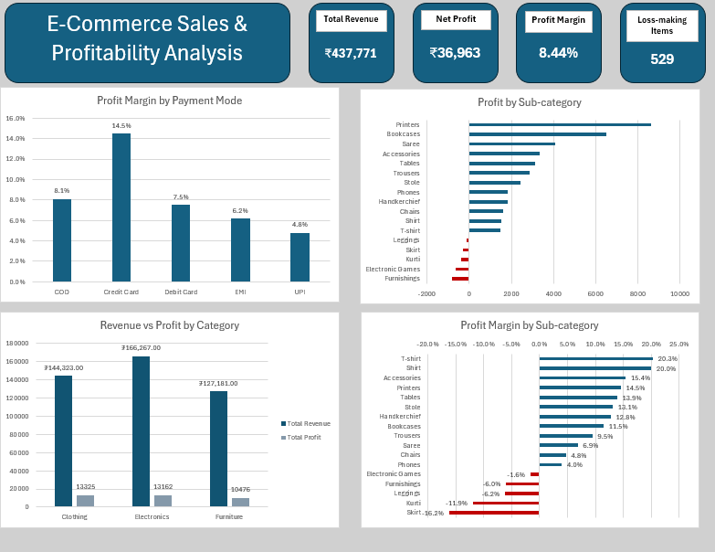

# E-Commerce Sales & Profitability Analysis

**Data Forge Challenge #002 | Tool: Microsoft Excel**

## Project Overview
This project analyzes e-commerce sales and profitability data to understand how sales volume, revenue, and profit vary across product categories, sub-categories, and payment modes.

The analysis was completed in Microsoft Excel, using data cleaning, PivotTables, calculations, and visualizations to identify major revenue drivers, profitable product areas, and sub-categories requiring further investigation.

## Business Objective
- Evaluate overall sales and profitability performance.
- Compare revenue and profit across product categories.
- Examine sales volume and average profit per unit.
- Identify high-performing and loss-making sub-categories.
- Compare profitability across payment modes.
- Provide practical recommendations based on the findings.

## Dataset
- 1,500 line items
- 500 unique orders
- 3 product categories
- 17 sub-categories
- 5 payment modes

Measures analyzed: revenue, profit, quantity sold, profit margin, and average profit per unit.

## Tools & Techniques
- Microsoft Excel
- Data cleaning
- Excel formulas (SUM, COUNTIF, COUNTA)
- PivotTables and PivotCharts
- KPI calculations
- Data visualization

## Key Performance Indicators
| KPI | Result |
|---|---|
| Total Revenue | ₹437,771 |
| Total Profit | ₹36,963 |
| Overall Profit Margin | 8.44% |
| Units Sold | 5,615 |
| Loss-making Line Items | 529 (35% of all line items) |

## Key Findings

### 1. Revenue and profit tell different stories
Electronics generated the highest revenue at ₹166,267, followed by Clothing at ₹144,323 and Furniture at ₹127,181. However, Clothing generated the highest total profit at ₹13,325, slightly above Electronics at ₹13,162. Generating more revenue does not necessarily mean generating the most profit.

### 2. Clothing had the highest sales volume but lower profit per unit
Clothing recorded 3,516 units sold, far more than Electronics and Furniture. However, its average profit per unit was only ₹3.79, compared with ₹11.41 for Electronics and ₹11.09 for Furniture.

### 3. Some sub-categories generated revenue while recording losses
- Electronic Games: ₹39,168 revenue, -₹644 profit
- Furnishings: ₹13,484 revenue, -₹806 profit
- Kurti: ₹3,361 revenue, -₹401 profit
- Skirt: ₹1,946 revenue, -₹315 profit
- Leggings: ₹2,106 revenue, -₹130 profit

Electronic Games stands out because it brought in the most revenue of the five and still ended in a loss. These results show areas where recorded costs exceeded revenue and warrant further investigation.

### 4. About 1 in 3 line items lost money
529 of the 1,500 line items (35%) recorded a loss, totalling ₹38,079. Profitable line items earned ₹75,042, so these losses removed about half of the profit the store would otherwise have made.

### 5. Payment mode affects profitability
Credit Card had the highest profit margin at about 14.5%, while UPI had the lowest at about 4.8%. The same store sold the same products, but the margin depended heavily on how customers paid.

### 6. Printers was a major profitable sub-category
Printers generated ₹59,252 in revenue and ₹8,606 in profit, making it the highest-performing sub-category by both measures.

## Recommendations
1. **Review loss-making sub-categories.** Investigate the pricing, sourcing costs, and other recorded costs of Electronic Games, Furnishings, Kurti, Skirt, and Leggings, starting with Electronic Games.
2. **Investigate loss-making line items.** Look for a common cause, such as discounting or high costs, across the 529 line items that lost money.
3. **Evaluate Clothing's profit per unit.** Clothing sells in large volume, but profit per unit is low. Review product-level margins and costs to find ways to improve profitability.
4. **Review payment modes.** Consider encouraging Credit Card payments, and check why UPI and EMI have lower margins.
5. **Study strong performers.** Examine products like Printers to understand what drives their stronger profitability.

## Dashboard
The Excel dashboard summarizes the analysis through:
- KPI cards: Total Revenue, Net Profit, Profit Margin, and Loss-making Items
- Profit by Sub-category
- Profit Margin by Payment Mode
- Revenue vs Profit by Category
- Profit Margin by Sub-category

## Files
- Excel workbook (.xlsx): full analysis and dashboard
- `Details_cleaned.csv`: dataset
- `dashboard.png`: dashboard screenshot

## Dataset Source
Data Forge Challenge #002 by Bayonle Makinde.
